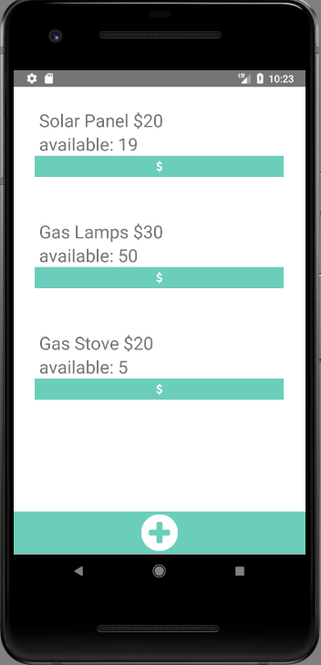

## Enventure Inventory Management Tool

This mobile-first app is an inventory management tool for cash-based entrepreneurs. Built on React Native for Android v 4.2.2 and to be run on low cost Android Phones.

### Description

Cash-based entrepreneurs that are using smartphones to help run their business don't have a way to keep track of inventory and sales in a simple way. This inventory management tool allows an entrepreneur to track and make predictions for inventory management in a context were internet access is not a given. Use case Uganda, Africa.


### Results
Prototype was handed to [Enventure Enterprises](https://www.enventureenterprises.org/) to be use as a proof of concept.

### List of sellable items

### Sale confirmation

### Add quantity

### Add new Item


### User Stories
- User signs up with phone number
- User creates inventory list of items in inventory, quantity and wholesale cost
- User inputs retail cost for inventory items available to sell
- User inputs items sold
- User can view weekly sales graph with quantity sold each day of that week
- User can plan for inventory updates with recommendation for quantity of item to buy to restock based on growth % and previous sales
- User can view weekly expense report of total $ earned, total $ spent, $ profit, growth %, loss %
- User can share expense report as an image

### Running

Before you run it, make sure you:  
```
$ git clone the-path  
$ cd the-folder-of-path  
$ npm install
```

If you don't have it, you'll need:  
```$ npm install --save react-native-form```  
```$ npm install --save react-native-router```  
```$ npm install --save react-native-swiper```  

### Running on Android

Make sure you've got the prereqs (SDK, Java)
Start an Android emulator
Start the app  
 ```$ react-native run-android```
